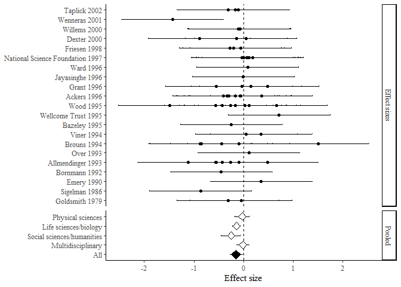

The purpose of ‘msemtools’ (metaSEM tools) is to help run meta-analyses
with metaSEM efficiently. The project is new and is in beta. Please
report any bugs

Installation
------------

To install msemtools run the following code:

``` r
#install.packages("devtools")
devtools::install_github("JConigrave/msemtools")
```

Running analyses
----------------

This packages is a shell around the metaSEM package. It does not perform
any calculations itself, but rather converts your instructions into
metaSEM commands, and then saves the results in a nicely formatted way.
Currently only meta3 is supported without the ability to set
contstraints.

I’ll demonstrate how to use it with Marsh’s data included in the metaSEM
package

``` r
library(dplyr)
library(metaSEM)
library(msemtools)
example_data <- metaSEM::Bornmann07 %>% 
  as_tibble
head(example_data)
```

    ## # A tibble: 6 x 9
    ##      Id Study      Cluster   logOR      v  Year Type   Discipline   Country
    ##   <int> <chr>        <int>   <dbl>  <dbl> <int> <fct>  <fct>        <fct>  
    ## 1     1 Ackers (2~       1 -0.401  0.0139  1996 Fello~ Physical sc~ Europe 
    ## 2     2 Ackers (2~       1 -0.0573 0.0343  1996 Fello~ Physical sc~ Europe 
    ## 3     3 Ackers (2~       1 -0.299  0.0339  1996 Fello~ Physical sc~ Europe 
    ## 4     4 Ackers (2~       1  0.361  0.0340  1996 Fello~ Physical sc~ Europe 
    ## 5     5 Ackers (2~       1 -0.333  0.0128  1996 Fello~ Social scie~ Europe 
    ## 6     6 Ackers (2~       1 -0.0717 0.0136  1996 Fello~ Physical sc~ Europe

We need to do some basic prep for this data: In this dataset year data
is held in two columns. This will ruin our plot so I remove them
parentheses and contents from the author column.

``` r
example_data$Study =  gsub("\\s*\\([^\\)]+\\)","",as.character(example_data$Study))
```

Running a basic model with metaSEM
----------------------------------

As the effect sizes are already set up for this dataset, we can start
running models. Here is the basic pooled effect size:

``` r
model0 <- meta3(
  y = logOR,
  v = v,
  cluster = Cluster,
  data = example_data,
  model.name = "3 level model"
)

summary(model0)
```

    ## 
    ## Call:
    ## meta3(y = logOR, v = v, cluster = Cluster, data = example_data, 
    ##     model.name = "3 level model")
    ## 
    ## 95% confidence intervals: z statistic approximation
    ## Coefficients:
    ##             Estimate  Std.Error     lbound     ubound z value Pr(>|z|)  
    ## Intercept -0.1007784  0.0401327 -0.1794371 -0.0221198 -2.5111  0.01203 *
    ## Tau2_2     0.0037965  0.0027210 -0.0015367  0.0091297  1.3952  0.16295  
    ## Tau2_3     0.0141352  0.0091445 -0.0037877  0.0320580  1.5458  0.12216  
    ## ---
    ## Signif. codes:  0 '***' 0.001 '**' 0.01 '*' 0.05 '.' 0.1 ' ' 1
    ## 
    ## Q statistic on the homogeneity of effect sizes: 221.2809
    ## Degrees of freedom of the Q statistic: 65
    ## P value of the Q statistic: 0
    ## 
    ## Heterogeneity indices (based on the estimated Tau2):
    ##                               Estimate
    ## I2_2 (Typical v: Q statistic)   0.1568
    ## I2_3 (Typical v: Q statistic)   0.5839
    ## 
    ## Number of studies (or clusters): 21
    ## Number of observed statistics: 66
    ## Number of estimated parameters: 3
    ## Degrees of freedom: 63
    ## -2 log likelihood: 25.80256 
    ## OpenMx status1: 0 ("0" or "1": The optimization is considered fine.
    ## Other values may indicate problems.)

The intercept tells us that the average logit was -0.1, there was some
heterogeneity between studies (I2\_3).

Moderation with msemtools
-------------------------

To run moderation with msemtools, covariates must be set up as factors.
Let’s look at Discipline

``` r
#set up factors
is.factor(example_data$Discipline)
```

    ## [1] TRUE

This is already a factor so we’re ready to go.

``` r
moderation_object = model0 %>% 
  moderate(Discipline)
moderation_object
```

<table>
<thead>
<tr>
<th style="text-align:left;">
</th>
<th style="text-align:left;">
moderation
</th>
<th style="text-align:left;">
model.name
</th>
<th style="text-align:right;">
k
</th>
<th style="text-align:right;">
n
</th>
<th style="text-align:right;">
estimate
</th>
<th style="text-align:right;">
SE
</th>
<th style="text-align:right;">
lbound
</th>
<th style="text-align:right;">
ubound
</th>
<th style="text-align:right;">
I2
</th>
<th style="text-align:right;">
I2\_3
</th>
<th style="text-align:left;">
slope
</th>
<th style="text-align:left;">
slope\_se
</th>
<th style="text-align:left;">
slope\_lbound
</th>
<th style="text-align:left;">
slope\_ubound
</th>
<th style="text-align:right;">
R2\_2
</th>
<th style="text-align:right;">
R2\_3
</th>
<th style="text-align:right;">
Mx\_status
</th>
<th style="text-align:right;">
anova p-value
</th>
<th style="text-align:left;">
type
</th>
</tr>
</thead>
<tbody>
<tr>
<td style="text-align:left;">
Baseline
</td>
<td style="text-align:left;">
Baseline
</td>
<td style="text-align:left;">
Baseline
</td>
<td style="text-align:right;">
21
</td>
<td style="text-align:right;">
66
</td>
<td style="text-align:right;">
-0.1520430
</td>
<td style="text-align:right;">
0.0645426
</td>
<td style="text-align:right;">
-0.2785441
</td>
<td style="text-align:right;">
-0.0255419
</td>
<td style="text-align:right;">
0
</td>
<td style="text-align:right;">
0
</td>
<td style="text-align:left;">
NA
</td>
<td style="text-align:left;">
NA
</td>
<td style="text-align:left;">
NA
</td>
<td style="text-align:left;">
NA
</td>
<td style="text-align:right;">
NA
</td>
<td style="text-align:right;">
NA
</td>
<td style="text-align:right;">
0
</td>
<td style="text-align:right;">
NA
</td>
<td style="text-align:left;">
Baseline
</td>
</tr>
<tr>
<td style="text-align:left;">
Discipline.1
</td>
<td style="text-align:left;">
Discipline
</td>
<td style="text-align:left;">
Discipline
</td>
<td style="text-align:right;">
21
</td>
<td style="text-align:right;">
66
</td>
<td style="text-align:right;">
NA
</td>
<td style="text-align:right;">
NA
</td>
<td style="text-align:right;">
NA
</td>
<td style="text-align:right;">
NA
</td>
<td style="text-align:right;">
NA
</td>
<td style="text-align:right;">
NA
</td>
<td style="text-align:left;">
NA
</td>
<td style="text-align:left;">
NA
</td>
<td style="text-align:left;">
NA
</td>
<td style="text-align:left;">
NA
</td>
<td style="text-align:right;">
0
</td>
<td style="text-align:right;">
0.4974673
</td>
<td style="text-align:right;">
0
</td>
<td style="text-align:right;">
0
</td>
<td style="text-align:left;">
factor
</td>
</tr>
<tr>
<td style="text-align:left;">
Discipline.2
</td>
<td style="text-align:left;">
Discipline
</td>
<td style="text-align:left;">
Physical sciences
</td>
<td style="text-align:right;">
5
</td>
<td style="text-align:right;">
14
</td>
<td style="text-align:right;">
-0.0238785
</td>
<td style="text-align:right;">
0.0764858
</td>
<td style="text-align:right;">
-0.1737878
</td>
<td style="text-align:right;">
0.1260308
</td>
<td style="text-align:right;">
NA
</td>
<td style="text-align:right;">
NA
</td>
<td style="text-align:left;">
NA
</td>
<td style="text-align:left;">
NA
</td>
<td style="text-align:left;">
NA
</td>
<td style="text-align:left;">
NA
</td>
<td style="text-align:right;">
NA
</td>
<td style="text-align:right;">
NA
</td>
<td style="text-align:right;">
NA
</td>
<td style="text-align:right;">
NA
</td>
<td style="text-align:left;">
factor level
</td>
</tr>
<tr>
<td style="text-align:left;">
Discipline.3
</td>
<td style="text-align:left;">
Discipline
</td>
<td style="text-align:left;">
Life sciences/biology
</td>
<td style="text-align:right;">
12
</td>
<td style="text-align:right;">
26
</td>
<td style="text-align:right;">
-0.1409274
</td>
<td style="text-align:right;">
0.0438924
</td>
<td style="text-align:right;">
-0.2269550
</td>
<td style="text-align:right;">
-0.0548999
</td>
<td style="text-align:right;">
NA
</td>
<td style="text-align:right;">
NA
</td>
<td style="text-align:left;">
NA
</td>
<td style="text-align:left;">
NA
</td>
<td style="text-align:left;">
NA
</td>
<td style="text-align:left;">
NA
</td>
<td style="text-align:right;">
NA
</td>
<td style="text-align:right;">
NA
</td>
<td style="text-align:right;">
NA
</td>
<td style="text-align:right;">
NA
</td>
<td style="text-align:left;">
factor level
</td>
</tr>
<tr>
<td style="text-align:left;">
Discipline.4
</td>
<td style="text-align:left;">
Discipline
</td>
<td style="text-align:left;">
Social sciences/humanities
</td>
<td style="text-align:right;">
5
</td>
<td style="text-align:right;">
13
</td>
<td style="text-align:right;">
-0.2517048
</td>
<td style="text-align:right;">
0.1016318
</td>
<td style="text-align:right;">
-0.4508995
</td>
<td style="text-align:right;">
-0.0525101
</td>
<td style="text-align:right;">
NA
</td>
<td style="text-align:right;">
NA
</td>
<td style="text-align:left;">
NA
</td>
<td style="text-align:left;">
NA
</td>
<td style="text-align:left;">
NA
</td>
<td style="text-align:left;">
NA
</td>
<td style="text-align:right;">
NA
</td>
<td style="text-align:right;">
NA
</td>
<td style="text-align:right;">
NA
</td>
<td style="text-align:right;">
NA
</td>
<td style="text-align:left;">
factor level
</td>
</tr>
<tr>
<td style="text-align:left;">
Discipline.5
</td>
<td style="text-align:left;">
Discipline
</td>
<td style="text-align:left;">
Multidisciplinary
</td>
<td style="text-align:right;">
5
</td>
<td style="text-align:right;">
13
</td>
<td style="text-align:right;">
-0.0147478
</td>
<td style="text-align:right;">
0.0638994
</td>
<td style="text-align:right;">
-0.1399885
</td>
<td style="text-align:right;">
0.1104928
</td>
<td style="text-align:right;">
NA
</td>
<td style="text-align:right;">
NA
</td>
<td style="text-align:left;">
NA
</td>
<td style="text-align:left;">
NA
</td>
<td style="text-align:left;">
NA
</td>
<td style="text-align:left;">
NA
</td>
<td style="text-align:right;">
NA
</td>
<td style="text-align:right;">
NA
</td>
<td style="text-align:right;">
NA
</td>
<td style="text-align:right;">
NA
</td>
<td style="text-align:left;">
factor level
</td>
</tr>
</tbody>
</table>

We can now plot easily \#\# forest plot

``` r
moderation_object %>% plot(author = "Study")
```

    ## year was not manually specified, using column:'Year'.FALSE



If author has et al in it, we would not have to manually specify it.

formatting
----------

If we want to add more moderators we just throw them into the moderation
argument with commas

``` r
moderation_object2 = model0 %>% 
  moderate(Discipline, Country, Type)

moderation_object2
```

<table>
<thead>
<tr>
<th style="text-align:left;">
</th>
<th style="text-align:left;">
moderation
</th>
<th style="text-align:left;">
model.name
</th>
<th style="text-align:right;">
k
</th>
<th style="text-align:right;">
n
</th>
<th style="text-align:right;">
estimate
</th>
<th style="text-align:right;">
SE
</th>
<th style="text-align:right;">
lbound
</th>
<th style="text-align:right;">
ubound
</th>
<th style="text-align:right;">
I2
</th>
<th style="text-align:right;">
I2\_3
</th>
<th style="text-align:left;">
slope
</th>
<th style="text-align:left;">
slope\_se
</th>
<th style="text-align:left;">
slope\_lbound
</th>
<th style="text-align:left;">
slope\_ubound
</th>
<th style="text-align:right;">
R2\_2
</th>
<th style="text-align:right;">
R2\_3
</th>
<th style="text-align:right;">
Mx\_status
</th>
<th style="text-align:right;">
anova p-value
</th>
<th style="text-align:left;">
type
</th>
</tr>
</thead>
<tbody>
<tr>
<td style="text-align:left;">
Baseline
</td>
<td style="text-align:left;">
Baseline
</td>
<td style="text-align:left;">
Baseline
</td>
<td style="text-align:right;">
21
</td>
<td style="text-align:right;">
66
</td>
<td style="text-align:right;">
-0.1520430
</td>
<td style="text-align:right;">
0.0645426
</td>
<td style="text-align:right;">
-0.2785441
</td>
<td style="text-align:right;">
-0.0255419
</td>
<td style="text-align:right;">
0
</td>
<td style="text-align:right;">
0
</td>
<td style="text-align:left;">
NA
</td>
<td style="text-align:left;">
NA
</td>
<td style="text-align:left;">
NA
</td>
<td style="text-align:left;">
NA
</td>
<td style="text-align:right;">
NA
</td>
<td style="text-align:right;">
NA
</td>
<td style="text-align:right;">
0
</td>
<td style="text-align:right;">
NA
</td>
<td style="text-align:left;">
Baseline
</td>
</tr>
<tr>
<td style="text-align:left;">
Discipline.1
</td>
<td style="text-align:left;">
Discipline
</td>
<td style="text-align:left;">
Discipline
</td>
<td style="text-align:right;">
21
</td>
<td style="text-align:right;">
66
</td>
<td style="text-align:right;">
NA
</td>
<td style="text-align:right;">
NA
</td>
<td style="text-align:right;">
NA
</td>
<td style="text-align:right;">
NA
</td>
<td style="text-align:right;">
NA
</td>
<td style="text-align:right;">
NA
</td>
<td style="text-align:left;">
NA
</td>
<td style="text-align:left;">
NA
</td>
<td style="text-align:left;">
NA
</td>
<td style="text-align:left;">
NA
</td>
<td style="text-align:right;">
0.0000000
</td>
<td style="text-align:right;">
0.4974673
</td>
<td style="text-align:right;">
0
</td>
<td style="text-align:right;">
0
</td>
<td style="text-align:left;">
factor
</td>
</tr>
<tr>
<td style="text-align:left;">
Discipline.2
</td>
<td style="text-align:left;">
Discipline
</td>
<td style="text-align:left;">
Physical sciences
</td>
<td style="text-align:right;">
5
</td>
<td style="text-align:right;">
14
</td>
<td style="text-align:right;">
-0.0238785
</td>
<td style="text-align:right;">
0.0764858
</td>
<td style="text-align:right;">
-0.1737878
</td>
<td style="text-align:right;">
0.1260308
</td>
<td style="text-align:right;">
NA
</td>
<td style="text-align:right;">
NA
</td>
<td style="text-align:left;">
NA
</td>
<td style="text-align:left;">
NA
</td>
<td style="text-align:left;">
NA
</td>
<td style="text-align:left;">
NA
</td>
<td style="text-align:right;">
NA
</td>
<td style="text-align:right;">
NA
</td>
<td style="text-align:right;">
NA
</td>
<td style="text-align:right;">
NA
</td>
<td style="text-align:left;">
factor level
</td>
</tr>
<tr>
<td style="text-align:left;">
Discipline.3
</td>
<td style="text-align:left;">
Discipline
</td>
<td style="text-align:left;">
Life sciences/biology
</td>
<td style="text-align:right;">
12
</td>
<td style="text-align:right;">
26
</td>
<td style="text-align:right;">
-0.1409274
</td>
<td style="text-align:right;">
0.0438924
</td>
<td style="text-align:right;">
-0.2269550
</td>
<td style="text-align:right;">
-0.0548999
</td>
<td style="text-align:right;">
NA
</td>
<td style="text-align:right;">
NA
</td>
<td style="text-align:left;">
NA
</td>
<td style="text-align:left;">
NA
</td>
<td style="text-align:left;">
NA
</td>
<td style="text-align:left;">
NA
</td>
<td style="text-align:right;">
NA
</td>
<td style="text-align:right;">
NA
</td>
<td style="text-align:right;">
NA
</td>
<td style="text-align:right;">
NA
</td>
<td style="text-align:left;">
factor level
</td>
</tr>
<tr>
<td style="text-align:left;">
Discipline.4
</td>
<td style="text-align:left;">
Discipline
</td>
<td style="text-align:left;">
Social sciences/humanities
</td>
<td style="text-align:right;">
5
</td>
<td style="text-align:right;">
13
</td>
<td style="text-align:right;">
-0.2517048
</td>
<td style="text-align:right;">
0.1016318
</td>
<td style="text-align:right;">
-0.4508995
</td>
<td style="text-align:right;">
-0.0525101
</td>
<td style="text-align:right;">
NA
</td>
<td style="text-align:right;">
NA
</td>
<td style="text-align:left;">
NA
</td>
<td style="text-align:left;">
NA
</td>
<td style="text-align:left;">
NA
</td>
<td style="text-align:left;">
NA
</td>
<td style="text-align:right;">
NA
</td>
<td style="text-align:right;">
NA
</td>
<td style="text-align:right;">
NA
</td>
<td style="text-align:right;">
NA
</td>
<td style="text-align:left;">
factor level
</td>
</tr>
<tr>
<td style="text-align:left;">
Discipline.5
</td>
<td style="text-align:left;">
Discipline
</td>
<td style="text-align:left;">
Multidisciplinary
</td>
<td style="text-align:right;">
5
</td>
<td style="text-align:right;">
13
</td>
<td style="text-align:right;">
-0.0147478
</td>
<td style="text-align:right;">
0.0638994
</td>
<td style="text-align:right;">
-0.1399885
</td>
<td style="text-align:right;">
0.1104928
</td>
<td style="text-align:right;">
NA
</td>
<td style="text-align:right;">
NA
</td>
<td style="text-align:left;">
NA
</td>
<td style="text-align:left;">
NA
</td>
<td style="text-align:left;">
NA
</td>
<td style="text-align:left;">
NA
</td>
<td style="text-align:right;">
NA
</td>
<td style="text-align:right;">
NA
</td>
<td style="text-align:right;">
NA
</td>
<td style="text-align:right;">
NA
</td>
<td style="text-align:left;">
factor level
</td>
</tr>
<tr>
<td style="text-align:left;">
Country.1
</td>
<td style="text-align:left;">
Country
</td>
<td style="text-align:left;">
Country
</td>
<td style="text-align:right;">
21
</td>
<td style="text-align:right;">
66
</td>
<td style="text-align:right;">
NA
</td>
<td style="text-align:right;">
NA
</td>
<td style="text-align:right;">
NA
</td>
<td style="text-align:right;">
NA
</td>
<td style="text-align:right;">
NA
</td>
<td style="text-align:right;">
NA
</td>
<td style="text-align:left;">
NA
</td>
<td style="text-align:left;">
NA
</td>
<td style="text-align:left;">
NA
</td>
<td style="text-align:left;">
NA
</td>
<td style="text-align:right;">
0.1208598
</td>
<td style="text-align:right;">
0.6605707
</td>
<td style="text-align:right;">
0
</td>
<td style="text-align:right;">
0
</td>
<td style="text-align:left;">
factor
</td>
</tr>
<tr>
<td style="text-align:left;">
Country.2
</td>
<td style="text-align:left;">
Country
</td>
<td style="text-align:left;">
United States
</td>
<td style="text-align:right;">
4
</td>
<td style="text-align:right;">
12
</td>
<td style="text-align:right;">
0.0025681
</td>
<td style="text-align:right;">
0.0597768
</td>
<td style="text-align:right;">
-0.1145923
</td>
<td style="text-align:right;">
0.1197285
</td>
<td style="text-align:right;">
NA
</td>
<td style="text-align:right;">
NA
</td>
<td style="text-align:left;">
NA
</td>
<td style="text-align:left;">
NA
</td>
<td style="text-align:left;">
NA
</td>
<td style="text-align:left;">
NA
</td>
<td style="text-align:right;">
NA
</td>
<td style="text-align:right;">
NA
</td>
<td style="text-align:right;">
NA
</td>
<td style="text-align:right;">
NA
</td>
<td style="text-align:left;">
factor level
</td>
</tr>
<tr>
<td style="text-align:left;">
Country.3
</td>
<td style="text-align:left;">
Country
</td>
<td style="text-align:left;">
Canada
</td>
<td style="text-align:right;">
1
</td>
<td style="text-align:right;">
3
</td>
<td style="text-align:right;">
-0.1315119
</td>
<td style="text-align:right;">
0.1026488
</td>
<td style="text-align:right;">
-0.3326998
</td>
<td style="text-align:right;">
0.0696760
</td>
<td style="text-align:right;">
NA
</td>
<td style="text-align:right;">
NA
</td>
<td style="text-align:left;">
NA
</td>
<td style="text-align:left;">
NA
</td>
<td style="text-align:left;">
NA
</td>
<td style="text-align:left;">
NA
</td>
<td style="text-align:right;">
NA
</td>
<td style="text-align:right;">
NA
</td>
<td style="text-align:right;">
NA
</td>
<td style="text-align:right;">
NA
</td>
<td style="text-align:left;">
factor level
</td>
</tr>
<tr>
<td style="text-align:left;">
Country.4
</td>
<td style="text-align:left;">
Country
</td>
<td style="text-align:left;">
Australia
</td>
<td style="text-align:right;">
5
</td>
<td style="text-align:right;">
13
</td>
<td style="text-align:right;">
-0.0214428
</td>
<td style="text-align:right;">
0.0926603
</td>
<td style="text-align:right;">
-0.2030538
</td>
<td style="text-align:right;">
0.1601681
</td>
<td style="text-align:right;">
NA
</td>
<td style="text-align:right;">
NA
</td>
<td style="text-align:left;">
NA
</td>
<td style="text-align:left;">
NA
</td>
<td style="text-align:left;">
NA
</td>
<td style="text-align:left;">
NA
</td>
<td style="text-align:right;">
NA
</td>
<td style="text-align:right;">
NA
</td>
<td style="text-align:right;">
NA
</td>
<td style="text-align:right;">
NA
</td>
<td style="text-align:left;">
factor level
</td>
</tr>
<tr>
<td style="text-align:left;">
Country.5
</td>
<td style="text-align:left;">
Country
</td>
<td style="text-align:left;">
United Kingdom
</td>
<td style="text-align:right;">
4
</td>
<td style="text-align:right;">
10
</td>
<td style="text-align:right;">
0.0562932
</td>
<td style="text-align:right;">
0.0790467
</td>
<td style="text-align:right;">
-0.0986354
</td>
<td style="text-align:right;">
0.2112219
</td>
<td style="text-align:right;">
NA
</td>
<td style="text-align:right;">
NA
</td>
<td style="text-align:left;">
NA
</td>
<td style="text-align:left;">
NA
</td>
<td style="text-align:left;">
NA
</td>
<td style="text-align:left;">
NA
</td>
<td style="text-align:right;">
NA
</td>
<td style="text-align:right;">
NA
</td>
<td style="text-align:right;">
NA
</td>
<td style="text-align:right;">
NA
</td>
<td style="text-align:left;">
factor level
</td>
</tr>
<tr>
<td style="text-align:left;">
Country.6
</td>
<td style="text-align:left;">
Country
</td>
<td style="text-align:left;">
Europe
</td>
<td style="text-align:right;">
7
</td>
<td style="text-align:right;">
28
</td>
<td style="text-align:right;">
-0.2185120
</td>
<td style="text-align:right;">
0.0500825
</td>
<td style="text-align:right;">
-0.3166718
</td>
<td style="text-align:right;">
-0.1203521
</td>
<td style="text-align:right;">
NA
</td>
<td style="text-align:right;">
NA
</td>
<td style="text-align:left;">
NA
</td>
<td style="text-align:left;">
NA
</td>
<td style="text-align:left;">
NA
</td>
<td style="text-align:left;">
NA
</td>
<td style="text-align:right;">
NA
</td>
<td style="text-align:right;">
NA
</td>
<td style="text-align:right;">
NA
</td>
<td style="text-align:right;">
NA
</td>
<td style="text-align:left;">
factor level
</td>
</tr>
<tr>
<td style="text-align:left;">
Type.1
</td>
<td style="text-align:left;">
Type
</td>
<td style="text-align:left;">
Type
</td>
<td style="text-align:right;">
21
</td>
<td style="text-align:right;">
66
</td>
<td style="text-align:right;">
NA
</td>
<td style="text-align:right;">
NA
</td>
<td style="text-align:right;">
NA
</td>
<td style="text-align:right;">
NA
</td>
<td style="text-align:right;">
NA
</td>
<td style="text-align:right;">
NA
</td>
<td style="text-align:left;">
NA
</td>
<td style="text-align:left;">
NA
</td>
<td style="text-align:left;">
NA
</td>
<td style="text-align:left;">
NA
</td>
<td style="text-align:right;">
0.0692595
</td>
<td style="text-align:right;">
0.7942804
</td>
<td style="text-align:right;">
0
</td>
<td style="text-align:right;">
0
</td>
<td style="text-align:left;">
factor
</td>
</tr>
<tr>
<td style="text-align:left;">
Type.2
</td>
<td style="text-align:left;">
Type
</td>
<td style="text-align:left;">
Grant
</td>
<td style="text-align:right;">
13
</td>
<td style="text-align:right;">
40
</td>
<td style="text-align:right;">
-0.0066071
</td>
<td style="text-align:right;">
0.0371125
</td>
<td style="text-align:right;">
-0.0793462
</td>
<td style="text-align:right;">
0.0661320
</td>
<td style="text-align:right;">
NA
</td>
<td style="text-align:right;">
NA
</td>
<td style="text-align:left;">
NA
</td>
<td style="text-align:left;">
NA
</td>
<td style="text-align:left;">
NA
</td>
<td style="text-align:left;">
NA
</td>
<td style="text-align:right;">
NA
</td>
<td style="text-align:right;">
NA
</td>
<td style="text-align:right;">
NA
</td>
<td style="text-align:right;">
NA
</td>
<td style="text-align:left;">
factor level
</td>
</tr>
<tr>
<td style="text-align:left;">
Type.3
</td>
<td style="text-align:left;">
Type
</td>
<td style="text-align:left;">
Fellowship
</td>
<td style="text-align:right;">
11
</td>
<td style="text-align:right;">
26
</td>
<td style="text-align:right;">
-0.2021940
</td>
<td style="text-align:right;">
0.0399473
</td>
<td style="text-align:right;">
-0.2804893
</td>
<td style="text-align:right;">
-0.1238987
</td>
<td style="text-align:right;">
NA
</td>
<td style="text-align:right;">
NA
</td>
<td style="text-align:left;">
NA
</td>
<td style="text-align:left;">
NA
</td>
<td style="text-align:left;">
NA
</td>
<td style="text-align:left;">
NA
</td>
<td style="text-align:right;">
NA
</td>
<td style="text-align:right;">
NA
</td>
<td style="text-align:right;">
NA
</td>
<td style="text-align:right;">
NA
</td>
<td style="text-align:left;">
factor level
</td>
</tr>
</tbody>
</table>

We can then format this table with another function

``` r
moderation_object2 %>% 
  format_nicely
```

<table>
<thead>
<tr>
<th style="text-align:left;">
</th>
<th style="text-align:left;">
indent
</th>
<th style="text-align:left;">
Moderator
</th>
<th style="text-align:left;">
k
</th>
<th style="text-align:left;">
n
</th>
<th style="text-align:left;">
Estimate (95% CI)
</th>
<th style="text-align:left;">
SE
</th>
<th style="text-align:left;">
R2\_2
</th>
<th style="text-align:left;">
R2\_3
</th>
<th style="text-align:left;">
p
</th>
</tr>
</thead>
<tbody>
<tr>
<td style="text-align:left;">
Baseline
</td>
<td style="text-align:left;">
FALSE
</td>
<td style="text-align:left;">
Baseline (I<sup>2</sup><sub>(2;3)</sub>: 0.00; 0.00)
</td>
<td style="text-align:left;">
21
</td>
<td style="text-align:left;">
66
</td>
<td style="text-align:left;">
-0.15 (-0.28, -0.03)
</td>
<td style="text-align:left;">
0.06
</td>
<td style="text-align:left;">

-   </td>
    <td style="text-align:left;">

    -   </td>
        <td style="text-align:left;">

        -   </td>
            </tr>
            <tr>
            <td style="text-align:left;">
            Discipline.1
            </td>
            <td style="text-align:left;">
            FALSE
            </td>
            <td style="text-align:left;">
            Discipline
            </td>
            <td style="text-align:left;">
            21
            </td>
            <td style="text-align:left;">
            66
            </td>
            <td style="text-align:left;">

            -   </td>
                <td style="text-align:left;">

                -   </td>
                    <td style="text-align:left;">
                    0.00
                    </td>
                    <td style="text-align:left;">
                    0.50
                    </td>
                    <td style="text-align:left;">
                    &lt; 0.01\*
                    </td>
                    </tr>
                    <tr>
                    <td style="text-align:left;">
                    Discipline.2
                    </td>
                    <td style="text-align:left;">
                    TRUE
                    </td>
                    <td style="text-align:left;">
                    Physical sciences
                    </td>
                    <td style="text-align:left;">
                    5
                    </td>
                    <td style="text-align:left;">
                    14
                    </td>
                    <td style="text-align:left;">
                    -0.02 (-0.17, 0.13)
                    </td>
                    <td style="text-align:left;">
                    0.08
                    </td>
                    <td style="text-align:left;">

                    -   </td>
                        <td style="text-align:left;">

                        -   </td>
                            <td style="text-align:left;">

                            -   </td>
                                </tr>
                                <tr>
                                <td style="text-align:left;">
                                Discipline.3
                                </td>
                                <td style="text-align:left;">
                                TRUE
                                </td>
                                <td style="text-align:left;">
                                Life sciences/biology
                                </td>
                                <td style="text-align:left;">
                                12
                                </td>
                                <td style="text-align:left;">
                                26
                                </td>
                                <td style="text-align:left;">
                                -0.14 (-0.23, -0.05)
                                </td>
                                <td style="text-align:left;">
                                0.04
                                </td>
                                <td style="text-align:left;">

                                -   </td>
                                    <td style="text-align:left;">

                                    -   </td>
                                        <td style="text-align:left;">

                                        -   </td>
                                            </tr>
                                            <tr>
                                            <td style="text-align:left;">
                                            Discipline.4
                                            </td>
                                            <td style="text-align:left;">
                                            TRUE
                                            </td>
                                            <td style="text-align:left;">
                                            Social sciences/humanities
                                            </td>
                                            <td style="text-align:left;">
                                            5
                                            </td>
                                            <td style="text-align:left;">
                                            13
                                            </td>
                                            <td style="text-align:left;">
                                            -0.25 (-0.45, -0.05)
                                            </td>
                                            <td style="text-align:left;">
                                            0.10
                                            </td>
                                            <td style="text-align:left;">

                                            -   </td>
                                                <td style="text-align:left;">

                                                -   </td>
                                                    <td style="text-align:left;">

                                                    -   </td>
                                                        </tr>
                                                        <tr>
                                                        <td style="text-align:left;">
                                                        Discipline.5
                                                        </td>
                                                        <td style="text-align:left;">
                                                        TRUE
                                                        </td>
                                                        <td style="text-align:left;">
                                                        Multidisciplinary
                                                        </td>
                                                        <td style="text-align:left;">
                                                        5
                                                        </td>
                                                        <td style="text-align:left;">
                                                        13
                                                        </td>
                                                        <td style="text-align:left;">
                                                        -0.01 (-0.14,
                                                        0.11)
                                                        </td>
                                                        <td style="text-align:left;">
                                                        0.06
                                                        </td>
                                                        <td style="text-align:left;">

                                                        -   </td>
                                                            <td style="text-align:left;">

                                                            -   </td>
                                                                <td style="text-align:left;">

                                                                -   </td>
                                                                    </tr>
                                                                    <tr>
                                                                    <td style="text-align:left;">
                                                                    Country.1
                                                                    </td>
                                                                    <td style="text-align:left;">
                                                                    FALSE
                                                                    </td>
                                                                    <td style="text-align:left;">
                                                                    Country
                                                                    </td>
                                                                    <td style="text-align:left;">
                                                                    21
                                                                    </td>
                                                                    <td style="text-align:left;">
                                                                    66
                                                                    </td>
                                                                    <td style="text-align:left;">

                                                                    -   </td>
                                                                        <td style="text-align:left;">

                                                                        -   </td>
                                                                            <td style="text-align:left;">
                                                                            0.12
                                                                            </td>
                                                                            <td style="text-align:left;">
                                                                            0.66
                                                                            </td>
                                                                            <td style="text-align:left;">
                                                                            &lt;
                                                                            0.01\*
                                                                            </td>
                                                                            </tr>
                                                                            <tr>
                                                                            <td style="text-align:left;">
                                                                            Country.2
                                                                            </td>
                                                                            <td style="text-align:left;">
                                                                            TRUE
                                                                            </td>
                                                                            <td style="text-align:left;">
                                                                            United
                                                                            States
                                                                            </td>
                                                                            <td style="text-align:left;">
                                                                            4
                                                                            </td>
                                                                            <td style="text-align:left;">
                                                                            12
                                                                            </td>
                                                                            <td style="text-align:left;">
                                                                            0.00
                                                                            (-0.11,
                                                                            0.12)
                                                                            </td>
                                                                            <td style="text-align:left;">
                                                                            0.06
                                                                            </td>
                                                                            <td style="text-align:left;">

                                                                            -   </td>
                                                                                <td style="text-align:left;">

                                                                                -   </td>
                                                                                    <td style="text-align:left;">

                                                                                    -   </td>
                                                                                        </tr>
                                                                                        <tr>
                                                                                        <td style="text-align:left;">
                                                                                        Country.3
                                                                                        </td>
                                                                                        <td style="text-align:left;">
                                                                                        TRUE
                                                                                        </td>
                                                                                        <td style="text-align:left;">
                                                                                        Canada
                                                                                        </td>
                                                                                        <td style="text-align:left;">
                                                                                        1
                                                                                        </td>
                                                                                        <td style="text-align:left;">
                                                                                        3
                                                                                        </td>
                                                                                        <td style="text-align:left;">
                                                                                        -0.13
                                                                                        (-0.33,
                                                                                        0.07)
                                                                                        </td>
                                                                                        <td style="text-align:left;">
                                                                                        0.10
                                                                                        </td>
                                                                                        <td style="text-align:left;">

                                                                                        -   </td>
                                                                                            <td style="text-align:left;">

                                                                                            -   </td>
                                                                                                <td style="text-align:left;">

                                                                                                -   </td>
                                                                                                    </tr>
                                                                                                    <tr>
                                                                                                    <td style="text-align:left;">
                                                                                                    Country.4
                                                                                                    </td>
                                                                                                    <td style="text-align:left;">
                                                                                                    TRUE
                                                                                                    </td>
                                                                                                    <td style="text-align:left;">
                                                                                                    Australia
                                                                                                    </td>
                                                                                                    <td style="text-align:left;">
                                                                                                    5
                                                                                                    </td>
                                                                                                    <td style="text-align:left;">
                                                                                                    13
                                                                                                    </td>
                                                                                                    <td style="text-align:left;">
                                                                                                    -0.02
                                                                                                    (-0.20,
                                                                                                    0.16)
                                                                                                    </td>
                                                                                                    <td style="text-align:left;">
                                                                                                    0.09
                                                                                                    </td>
                                                                                                    <td style="text-align:left;">

                                                                                                    -   </td>
                                                                                                        <td style="text-align:left;">

                                                                                                        -   </td>
                                                                                                            <td style="text-align:left;">

                                                                                                            -   </td>
                                                                                                                </tr>
                                                                                                                <tr>
                                                                                                                <td style="text-align:left;">
                                                                                                                Country.5
                                                                                                                </td>
                                                                                                                <td style="text-align:left;">
                                                                                                                TRUE
                                                                                                                </td>
                                                                                                                <td style="text-align:left;">
                                                                                                                United
                                                                                                                Kingdom
                                                                                                                </td>
                                                                                                                <td style="text-align:left;">
                                                                                                                4
                                                                                                                </td>
                                                                                                                <td style="text-align:left;">
                                                                                                                10
                                                                                                                </td>
                                                                                                                <td style="text-align:left;">
                                                                                                                0.06
                                                                                                                (-0.10,
                                                                                                                0.21)
                                                                                                                </td>
                                                                                                                <td style="text-align:left;">
                                                                                                                0.08
                                                                                                                </td>
                                                                                                                <td style="text-align:left;">

                                                                                                                -   </td>
                                                                                                                    <td style="text-align:left;">

                                                                                                                    -   </td>
                                                                                                                        <td style="text-align:left;">

                                                                                                                        -   </td>
                                                                                                                            </tr>
                                                                                                                            <tr>
                                                                                                                            <td style="text-align:left;">
                                                                                                                            Country.6
                                                                                                                            </td>
                                                                                                                            <td style="text-align:left;">
                                                                                                                            TRUE
                                                                                                                            </td>
                                                                                                                            <td style="text-align:left;">
                                                                                                                            Europe
                                                                                                                            </td>
                                                                                                                            <td style="text-align:left;">
                                                                                                                            7
                                                                                                                            </td>
                                                                                                                            <td style="text-align:left;">
                                                                                                                            28
                                                                                                                            </td>
                                                                                                                            <td style="text-align:left;">
                                                                                                                            -0.22
                                                                                                                            (-0.32,
                                                                                                                            -0.12)
                                                                                                                            </td>
                                                                                                                            <td style="text-align:left;">
                                                                                                                            0.05
                                                                                                                            </td>
                                                                                                                            <td style="text-align:left;">

                                                                                                                            -   </td>
                                                                                                                                <td style="text-align:left;">

                                                                                                                                -   </td>
                                                                                                                                    <td style="text-align:left;">

                                                                                                                                    -   </td>
                                                                                                                                        </tr>
                                                                                                                                        <tr>
                                                                                                                                        <td style="text-align:left;">
                                                                                                                                        Type.1
                                                                                                                                        </td>
                                                                                                                                        <td style="text-align:left;">
                                                                                                                                        FALSE
                                                                                                                                        </td>
                                                                                                                                        <td style="text-align:left;">
                                                                                                                                        Type
                                                                                                                                        </td>
                                                                                                                                        <td style="text-align:left;">
                                                                                                                                        21
                                                                                                                                        </td>
                                                                                                                                        <td style="text-align:left;">
                                                                                                                                        66
                                                                                                                                        </td>
                                                                                                                                        <td style="text-align:left;">

                                                                                                                                        -   </td>
                                                                                                                                            <td style="text-align:left;">

                                                                                                                                            -   </td>
                                                                                                                                                <td style="text-align:left;">
                                                                                                                                                0.07
                                                                                                                                                </td>
                                                                                                                                                <td style="text-align:left;">
                                                                                                                                                0.79
                                                                                                                                                </td>
                                                                                                                                                <td style="text-align:left;">
                                                                                                                                                &lt;
                                                                                                                                                0.01\*
                                                                                                                                                </td>
                                                                                                                                                </tr>
                                                                                                                                                <tr>
                                                                                                                                                <td style="text-align:left;">
                                                                                                                                                Type.2
                                                                                                                                                </td>
                                                                                                                                                <td style="text-align:left;">
                                                                                                                                                TRUE
                                                                                                                                                </td>
                                                                                                                                                <td style="text-align:left;">
                                                                                                                                                Grant
                                                                                                                                                </td>
                                                                                                                                                <td style="text-align:left;">
                                                                                                                                                13
                                                                                                                                                </td>
                                                                                                                                                <td style="text-align:left;">
                                                                                                                                                40
                                                                                                                                                </td>
                                                                                                                                                <td style="text-align:left;">
                                                                                                                                                -0.01
                                                                                                                                                (-0.08,
                                                                                                                                                0.07)
                                                                                                                                                </td>
                                                                                                                                                <td style="text-align:left;">
                                                                                                                                                0.04
                                                                                                                                                </td>
                                                                                                                                                <td style="text-align:left;">

                                                                                                                                                -   </td>
                                                                                                                                                    <td style="text-align:left;">

                                                                                                                                                    -   </td>
                                                                                                                                                        <td style="text-align:left;">

                                                                                                                                                        -   </td>
                                                                                                                                                            </tr>
                                                                                                                                                            <tr>
                                                                                                                                                            <td style="text-align:left;">
                                                                                                                                                            Type.3
                                                                                                                                                            </td>
                                                                                                                                                            <td style="text-align:left;">
                                                                                                                                                            TRUE
                                                                                                                                                            </td>
                                                                                                                                                            <td style="text-align:left;">
                                                                                                                                                            Fellowship
                                                                                                                                                            </td>
                                                                                                                                                            <td style="text-align:left;">
                                                                                                                                                            11
                                                                                                                                                            </td>
                                                                                                                                                            <td style="text-align:left;">
                                                                                                                                                            26
                                                                                                                                                            </td>
                                                                                                                                                            <td style="text-align:left;">
                                                                                                                                                            -0.20
                                                                                                                                                            (-0.28,
                                                                                                                                                            -0.12)
                                                                                                                                                            </td>
                                                                                                                                                            <td style="text-align:left;">
                                                                                                                                                            0.04
                                                                                                                                                            </td>
                                                                                                                                                            <td style="text-align:left;">

                                                                                                                                                            -   </td>
                                                                                                                                                                <td style="text-align:left;">

                                                                                                                                                                -   </td>
                                                                                                                                                                    <td style="text-align:left;">

                                                                                                                                                                    -   </td>
                                                                                                                                                                        </tr>
                                                                                                                                                                        </tbody>
                                                                                                                                                                        </table>

An indent column can be used to send formatting instuctions to word.

an extra column can help here msemtools::to\_apa

Funnel plots
------------

Finally, a function is provided to create a funnel plot from metaSEM
models. An egger’s assymetry test is also automatically reported to try
and detect publication bias.

``` r
model0 %>% funnel_plot
```

    ## $plot


    ## 
    ## $reg_test
    ## 
    ## Regression Test for Funnel Plot Asymmetry
    ## 
    ## model:     mixed-effects meta-regression model
    ## predictor: standard error
    ## 
    ## test for funnel plot asymmetry: z = -1.9925, p = 0.0463
