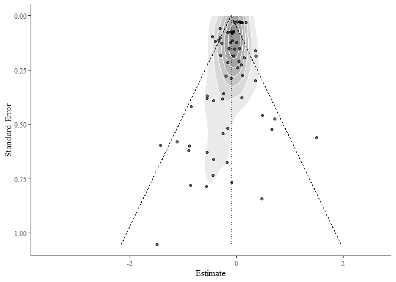

The purpose of ‘msemtools’ (metaSEM tools) is to help run meta-analyses
with metaSEM efficiently. The project is new and is in beta. Please
report any bugs

Installation
------------

To install msemtools run the following code:

``` r
#install.packages("devtools")
devtools::install_github("JConigrave/msemtools")
```

Running analyses
----------------

This packages is a shell around the metaSEM package. It does not perform
any calculations itself, but rather converts your instructions into
metaSEM commands, and then saves the results in a nicely formatted way.
Currently only meta3 is supported without the ability to set
constraints.

I’ll demonstrate how to use it with Marsh’s data included in the metaSEM
package

``` r
library(dplyr)
library(metaSEM)
library(msemtools)
example_data <- metaSEM::Bornmann07 %>% 
  as_tibble
head(example_data)
```

    ## # A tibble: 6 x 9
    ##      Id Study      Cluster   logOR      v  Year Type   Discipline   Country
    ##   <int> <chr>        <int>   <dbl>  <dbl> <int> <fct>  <fct>        <fct>  
    ## 1     1 Ackers (2~       1 -0.401  0.0139  1996 Fello~ Physical sc~ Europe 
    ## 2     2 Ackers (2~       1 -0.0573 0.0343  1996 Fello~ Physical sc~ Europe 
    ## 3     3 Ackers (2~       1 -0.299  0.0339  1996 Fello~ Physical sc~ Europe 
    ## 4     4 Ackers (2~       1  0.361  0.0340  1996 Fello~ Physical sc~ Europe 
    ## 5     5 Ackers (2~       1 -0.333  0.0128  1996 Fello~ Social scie~ Europe 
    ## 6     6 Ackers (2~       1 -0.0717 0.0136  1996 Fello~ Physical sc~ Europe

We need to do some basic prep for this data: In this dataset data for
‘year’ is held in its own column as well as the Study column. This will
ruin our plot. I fix this by removing everything in parentheses in the
Study column.

``` r
example_data$Study =  gsub("\\s*\\([^\\)]+\\)","",as.character(example_data$Study))
```

Running a basic model with metaSEM
----------------------------------

As the effect sizes are already set up for this dataset, we can start
running models. Here is the basic pooled effect size:

``` r
model0 <- meta3(
  y = logOR,
  v = v,
  cluster = Cluster,
  data = example_data,
  model.name = "3 level model"
)

summary(model0)
```

    ## 
    ## Call:
    ## meta3(y = logOR, v = v, cluster = Cluster, data = example_data, 
    ##     model.name = "3 level model")
    ## 
    ## 95% confidence intervals: z statistic approximation
    ## Coefficients:
    ##             Estimate  Std.Error     lbound     ubound z value Pr(>|z|)  
    ## Intercept -0.1007784  0.0401327 -0.1794371 -0.0221198 -2.5111  0.01203 *
    ## Tau2_2     0.0037965  0.0027210 -0.0015367  0.0091297  1.3952  0.16295  
    ## Tau2_3     0.0141352  0.0091445 -0.0037877  0.0320580  1.5458  0.12216  
    ## ---
    ## Signif. codes:  0 '***' 0.001 '**' 0.01 '*' 0.05 '.' 0.1 ' ' 1
    ## 
    ## Q statistic on the homogeneity of effect sizes: 221.2809
    ## Degrees of freedom of the Q statistic: 65
    ## P value of the Q statistic: 0
    ## 
    ## Heterogeneity indices (based on the estimated Tau2):
    ##                               Estimate
    ## I2_2 (Typical v: Q statistic)   0.1568
    ## I2_3 (Typical v: Q statistic)   0.5839
    ## 
    ## Number of studies (or clusters): 21
    ## Number of observed statistics: 66
    ## Number of estimated parameters: 3
    ## Degrees of freedom: 63
    ## -2 log likelihood: 25.80256 
    ## OpenMx status1: 0 ("0" or "1": The optimization is considered fine.
    ## Other values may indicate problems.)

The intercept tells us that the average logit was -0.1, there was some
heterogeneity between studies (I2\_3).

Moderation with msemtools
-------------------------

To run moderation with msemtools, covariates must be set up as factors.
Let’s look at Country

``` r
#set up factors
is.factor(example_data$Country)
```

    ## [1] TRUE

This is already a factor so we’re ready to go.

``` r
moderation_object = model0 %>% 
  moderate(Country)
moderation_object
```

<!--html_preserve-->
<style>html {
  font-family: -apple-system, BlinkMacSystemFont, 'Segoe UI', Roboto, Oxygen, Ubuntu, Cantarell, 'Helvetica Neue', 'Fira Sans', 'Droid Sans', Arial, sans-serif;
}

#sywwgwxizj .gt_table {
  display: table;
  border-collapse: collapse;
  margin-left: auto;
  margin-right: auto;
  color: #000000;
  font-size: 16px;
  background-color: #FFFFFF;
  /* table.background.color */
  width: auto;
  /* table.width */
  border-top-style: solid;
  /* table.border.top.style */
  border-top-width: 2px;
  /* table.border.top.width */
  border-top-color: #A8A8A8;
  /* table.border.top.color */
}

#sywwgwxizj .gt_heading {
  background-color: #FFFFFF;
  /* heading.background.color */
  border-bottom-color: #FFFFFF;
}

#sywwgwxizj .gt_title {
  color: #000000;
  font-size: 125%;
  /* heading.title.font.size */
  padding-top: 4px;
  /* heading.top.padding */
  padding-bottom: 1px;
  border-bottom-color: #FFFFFF;
  border-bottom-width: 0;
}

#sywwgwxizj .gt_subtitle {
  color: #000000;
  font-size: 85%;
  /* heading.subtitle.font.size */
  padding-top: 1px;
  padding-bottom: 4px;
  /* heading.bottom.padding */
  border-top-color: #FFFFFF;
  border-top-width: 0;
}

#sywwgwxizj .gt_bottom_border {
  border-bottom-style: solid;
  /* heading.border.bottom.style */
  border-bottom-width: 2px;
  /* heading.border.bottom.width */
  border-bottom-color: #A8A8A8;
  /* heading.border.bottom.color */
}

#sywwgwxizj .gt_column_spanner {
  border-bottom-style: solid;
  border-bottom-width: 2px;
  border-bottom-color: #A8A8A8;
  padding-top: 4px;
  padding-bottom: 4px;
}

#sywwgwxizj .gt_col_heading {
  color: #000000;
  background-color: #FFFFFF;
  /* column_labels.background.color */
  font-size: 16px;
  /* column_labels.font.size */
  font-weight: initial;
  /* column_labels.font.weight */
  vertical-align: middle;
  padding: 10px;
  margin: 10px;
}

#sywwgwxizj .gt_sep_right {
  border-right: 5px solid #FFFFFF;
}

#sywwgwxizj .gt_group_heading {
  padding: 8px;
  color: #000000;
  background-color: #FFFFFF;
  /* stub_group.background.color */
  font-size: 16px;
  /* stub_group.font.size */
  font-weight: initial;
  /* stub_group.font.weight */
  border-top-style: solid;
  /* stub_group.border.top.style */
  border-top-width: 2px;
  /* stub_group.border.top.width */
  border-top-color: #A8A8A8;
  /* stub_group.border.top.color */
  border-bottom-style: solid;
  /* stub_group.border.bottom.style */
  border-bottom-width: 2px;
  /* stub_group.border.bottom.width */
  border-bottom-color: #A8A8A8;
  /* stub_group.border.bottom.color */
  vertical-align: middle;
}

#sywwgwxizj .gt_empty_group_heading {
  padding: 0.5px;
  color: #000000;
  background-color: #FFFFFF;
  /* stub_group.background.color */
  font-size: 16px;
  /* stub_group.font.size */
  font-weight: initial;
  /* stub_group.font.weight */
  border-top-style: solid;
  /* stub_group.border.top.style */
  border-top-width: 2px;
  /* stub_group.border.top.width */
  border-top-color: #A8A8A8;
  /* stub_group.border.top.color */
  border-bottom-style: solid;
  /* stub_group.border.bottom.style */
  border-bottom-width: 2px;
  /* stub_group.border.bottom.width */
  border-bottom-color: #A8A8A8;
  /* stub_group.border.bottom.color */
  vertical-align: middle;
}

#sywwgwxizj .gt_striped {
  background-color: #f2f2f2;
}

#sywwgwxizj .gt_row {
  padding: 10px;
  /* row.padding */
  margin: 10px;
  vertical-align: middle;
}

#sywwgwxizj .gt_stub {
  border-right-style: solid;
  border-right-width: 2px;
  border-right-color: #A8A8A8;
  padding-left: 12px;
}

#sywwgwxizj .gt_stub.gt_row {
  background-color: #FFFFFF;
}

#sywwgwxizj .gt_summary_row {
  background-color: #FFFFFF;
  /* summary_row.background.color */
  padding: 6px;
  /* summary_row.padding */
  text-transform: inherit;
  /* summary_row.text_transform */
}

#sywwgwxizj .gt_first_summary_row {
  border-top-style: solid;
  border-top-width: 2px;
  border-top-color: #A8A8A8;
}

#sywwgwxizj .gt_table_body {
  border-top-style: solid;
  /* field.border.top.style */
  border-top-width: 2px;
  /* field.border.top.width */
  border-top-color: #A8A8A8;
  /* field.border.top.color */
  border-bottom-style: solid;
  /* field.border.bottom.style */
  border-bottom-width: 2px;
  /* field.border.bottom.width */
  border-bottom-color: #A8A8A8;
  /* field.border.bottom.color */
}

#sywwgwxizj .gt_footnote {
  font-size: 90%;
  /* footnote.font.size */
  padding: 4px;
  /* footnote.padding */
}

#sywwgwxizj .gt_sourcenote {
  font-size: 90%;
  /* sourcenote.font.size */
  padding: 4px;
  /* sourcenote.padding */
}

#sywwgwxizj .gt_center {
  text-align: center;
}

#sywwgwxizj .gt_left {
  text-align: left;
}

#sywwgwxizj .gt_right {
  text-align: right;
  font-variant-numeric: tabular-nums;
}

#sywwgwxizj .gt_font_normal {
  font-weight: normal;
}

#sywwgwxizj .gt_font_bold {
  font-weight: bold;
}

#sywwgwxizj .gt_font_italic {
  font-style: italic;
}

#sywwgwxizj .gt_super {
  font-size: 65%;
}

#sywwgwxizj .gt_footnote_glyph {
  font-style: italic;
  font-size: 65%;
}
</style>

<!--gt table start-->
<table class="gt_table">
<tr>
<th class="gt_col_heading gt_left" rowspan="1" colspan="1">
moderation
</th>
<th class="gt_col_heading gt_left" rowspan="1" colspan="1">
model.name
</th>
<th class="gt_col_heading gt_right" rowspan="1" colspan="1">
k
</th>
<th class="gt_col_heading gt_right" rowspan="1" colspan="1">
n
</th>
<th class="gt_col_heading gt_right" rowspan="1" colspan="1">
estimate
</th>
<th class="gt_col_heading gt_right" rowspan="1" colspan="1">
SE
</th>
<th class="gt_col_heading gt_right" rowspan="1" colspan="1">
lbound
</th>
<th class="gt_col_heading gt_right" rowspan="1" colspan="1">
ubound
</th>
<th class="gt_col_heading gt_right" rowspan="1" colspan="1">
I2\_2
</th>
<th class="gt_col_heading gt_right" rowspan="1" colspan="1">
I2\_3
</th>
<th class="gt_col_heading gt_center" rowspan="1" colspan="1">
slope
</th>
<th class="gt_col_heading gt_center" rowspan="1" colspan="1">
slope\_se
</th>
<th class="gt_col_heading gt_center" rowspan="1" colspan="1">
slope\_lbound
</th>
<th class="gt_col_heading gt_center" rowspan="1" colspan="1">
slope\_ubound
</th>
<th class="gt_col_heading gt_right" rowspan="1" colspan="1">
R2\_2
</th>
<th class="gt_col_heading gt_right" rowspan="1" colspan="1">
R2\_3
</th>
<th class="gt_col_heading gt_right" rowspan="1" colspan="1">
Mx\_status
</th>
<th class="gt_col_heading gt_right" rowspan="1" colspan="1">
anova p-value
</th>
<th class="gt_col_heading gt_left" rowspan="1" colspan="1">
type
</th>
</tr>
<tbody class="gt_table_body">
<tr>
<td class="gt_row gt_left">
Baseline
</td>
<td class="gt_row gt_left">
Baseline
</td>
<td class="gt_row gt_right">
21
</td>
<td class="gt_row gt_right">
66
</td>
<td class="gt_row gt_right">
-0.10077844
</td>
<td class="gt_row gt_right">
0.04013268
</td>
<td class="gt_row gt_right">
-0.17943706
</td>
<td class="gt_row gt_right">
-0.02211983
</td>
<td class="gt_row gt_right">
0.1568322
</td>
<td class="gt_row gt_right">
0.5839199
</td>
<td class="gt_row gt_center">
NA
</td>
<td class="gt_row gt_center">
NA
</td>
<td class="gt_row gt_center">
NA
</td>
<td class="gt_row gt_center">
NA
</td>
<td class="gt_row gt_right">
NA
</td>
<td class="gt_row gt_right">
NA
</td>
<td class="gt_row gt_right">
0
</td>
<td class="gt_row gt_right">
NA
</td>
<td class="gt_row gt_left">
Baseline
</td>
</tr>
<tr>
<td class="gt_row gt_left gt_striped">
Country
</td>
<td class="gt_row gt_left gt_striped">
Country
</td>
<td class="gt_row gt_right gt_striped">
21
</td>
<td class="gt_row gt_right gt_striped">
66
</td>
<td class="gt_row gt_right gt_striped">
NA
</td>
<td class="gt_row gt_right gt_striped">
NA
</td>
<td class="gt_row gt_right gt_striped">
NA
</td>
<td class="gt_row gt_right gt_striped">
NA
</td>
<td class="gt_row gt_right gt_striped">
NA
</td>
<td class="gt_row gt_right gt_striped">
NA
</td>
<td class="gt_row gt_center gt_striped">
NA
</td>
<td class="gt_row gt_center gt_striped">
NA
</td>
<td class="gt_row gt_center gt_striped">
NA
</td>
<td class="gt_row gt_center gt_striped">
NA
</td>
<td class="gt_row gt_right gt_striped">
0.1208598
</td>
<td class="gt_row gt_right gt_striped">
0.6605707
</td>
<td class="gt_row gt_right gt_striped">
0
</td>
<td class="gt_row gt_right gt_striped">
0.02041284
</td>
<td class="gt_row gt_left gt_striped">
factor
</td>
</tr>
<tr>
<td class="gt_row gt_left">
Country
</td>
<td class="gt_row gt_left">
United States
</td>
<td class="gt_row gt_right">
4
</td>
<td class="gt_row gt_right">
12
</td>
<td class="gt_row gt_right">
0.00256810
</td>
<td class="gt_row gt_right">
0.05977679
</td>
<td class="gt_row gt_right">
-0.11459226
</td>
<td class="gt_row gt_right">
0.11972846
</td>
<td class="gt_row gt_right">
NA
</td>
<td class="gt_row gt_right">
NA
</td>
<td class="gt_row gt_center">
NA
</td>
<td class="gt_row gt_center">
NA
</td>
<td class="gt_row gt_center">
NA
</td>
<td class="gt_row gt_center">
NA
</td>
<td class="gt_row gt_right">
NA
</td>
<td class="gt_row gt_right">
NA
</td>
<td class="gt_row gt_right">
NA
</td>
<td class="gt_row gt_right">
NA
</td>
<td class="gt_row gt_left">
factor level
</td>
</tr>
<tr>
<td class="gt_row gt_left gt_striped">
Country
</td>
<td class="gt_row gt_left gt_striped">
Canada
</td>
<td class="gt_row gt_right gt_striped">
1
</td>
<td class="gt_row gt_right gt_striped">
3
</td>
<td class="gt_row gt_right gt_striped">
-0.13151188
</td>
<td class="gt_row gt_right gt_striped">
0.10264878
</td>
<td class="gt_row gt_right gt_striped">
-0.33269979
</td>
<td class="gt_row gt_right gt_striped">
0.06967602
</td>
<td class="gt_row gt_right gt_striped">
NA
</td>
<td class="gt_row gt_right gt_striped">
NA
</td>
<td class="gt_row gt_center gt_striped">
NA
</td>
<td class="gt_row gt_center gt_striped">
NA
</td>
<td class="gt_row gt_center gt_striped">
NA
</td>
<td class="gt_row gt_center gt_striped">
NA
</td>
<td class="gt_row gt_right gt_striped">
NA
</td>
<td class="gt_row gt_right gt_striped">
NA
</td>
<td class="gt_row gt_right gt_striped">
NA
</td>
<td class="gt_row gt_right gt_striped">
NA
</td>
<td class="gt_row gt_left gt_striped">
factor level
</td>
</tr>
<tr>
<td class="gt_row gt_left">
Country
</td>
<td class="gt_row gt_left">
Australia
</td>
<td class="gt_row gt_right">
5
</td>
<td class="gt_row gt_right">
13
</td>
<td class="gt_row gt_right">
-0.02144284
</td>
<td class="gt_row gt_right">
0.09266035
</td>
<td class="gt_row gt_right">
-0.20305379
</td>
<td class="gt_row gt_right">
0.16016811
</td>
<td class="gt_row gt_right">
NA
</td>
<td class="gt_row gt_right">
NA
</td>
<td class="gt_row gt_center">
NA
</td>
<td class="gt_row gt_center">
NA
</td>
<td class="gt_row gt_center">
NA
</td>
<td class="gt_row gt_center">
NA
</td>
<td class="gt_row gt_right">
NA
</td>
<td class="gt_row gt_right">
NA
</td>
<td class="gt_row gt_right">
NA
</td>
<td class="gt_row gt_right">
NA
</td>
<td class="gt_row gt_left">
factor level
</td>
</tr>
<tr>
<td class="gt_row gt_left gt_striped">
Country
</td>
<td class="gt_row gt_left gt_striped">
United Kingdom
</td>
<td class="gt_row gt_right gt_striped">
4
</td>
<td class="gt_row gt_right gt_striped">
10
</td>
<td class="gt_row gt_right gt_striped">
0.05629323
</td>
<td class="gt_row gt_right gt_striped">
0.07904668
</td>
<td class="gt_row gt_right gt_striped">
-0.09863541
</td>
<td class="gt_row gt_right gt_striped">
0.21122188
</td>
<td class="gt_row gt_right gt_striped">
NA
</td>
<td class="gt_row gt_right gt_striped">
NA
</td>
<td class="gt_row gt_center gt_striped">
NA
</td>
<td class="gt_row gt_center gt_striped">
NA
</td>
<td class="gt_row gt_center gt_striped">
NA
</td>
<td class="gt_row gt_center gt_striped">
NA
</td>
<td class="gt_row gt_right gt_striped">
NA
</td>
<td class="gt_row gt_right gt_striped">
NA
</td>
<td class="gt_row gt_right gt_striped">
NA
</td>
<td class="gt_row gt_right gt_striped">
NA
</td>
<td class="gt_row gt_left gt_striped">
factor level
</td>
</tr>
<tr>
<td class="gt_row gt_left">
Country
</td>
<td class="gt_row gt_left">
Europe
</td>
<td class="gt_row gt_right">
7
</td>
<td class="gt_row gt_right">
28
</td>
<td class="gt_row gt_right">
-0.21851199
</td>
<td class="gt_row gt_right">
0.05008248
</td>
<td class="gt_row gt_right">
-0.31667184
</td>
<td class="gt_row gt_right">
-0.12035214
</td>
<td class="gt_row gt_right">
NA
</td>
<td class="gt_row gt_right">
NA
</td>
<td class="gt_row gt_center">
NA
</td>
<td class="gt_row gt_center">
NA
</td>
<td class="gt_row gt_center">
NA
</td>
<td class="gt_row gt_center">
NA
</td>
<td class="gt_row gt_right">
NA
</td>
<td class="gt_row gt_right">
NA
</td>
<td class="gt_row gt_right">
NA
</td>
<td class="gt_row gt_right">
NA
</td>
<td class="gt_row gt_left">
factor level
</td>
</tr>
</tbody>
</table>
<!--gt table end-->

<!--/html_preserve-->

We can now plot easily \#\# forest plot

``` r
moderation_object %>% plot(author = "Study")
```

    ## year was not manually specified, using: 'Year'.


If author has et al in it, we would not have to manually specify it.

formatting
----------

If we want to add more moderators we just throw them into the moderation
argument with commas

``` r
moderation_object2 = model0 %>% 
  moderate(Discipline, Country, Type)

moderation_object2
```

    ## # A tibble: 15 x 19
    ##    moderation model.name     k     n  estimate      SE   lbound   ubound
    ##  * <chr>      <chr>      <dbl> <dbl>     <dbl>   <dbl>    <dbl>    <dbl>
    ##  1 Baseline   Baseline      21    66  -0.101    0.0401  -0.179   -0.0221
    ##  2 Discipline Discipline    21    66  NA       NA       NA       NA     
    ##  3 Discipline Physical ~     5    14  -0.0239   0.0765  -0.174    0.126 
    ##  4 Discipline Life scie~    12    26  -0.141    0.0439  -0.227   -0.0549
    ##  5 Discipline Social sc~     5    13  -0.252    0.102   -0.451   -0.0525
    ##  6 Discipline Multidisc~     5    13  -0.0147   0.0639  -0.140    0.110 
    ##  7 Country    Country       21    66  NA       NA       NA       NA     
    ##  8 Country    United St~     4    12   0.00257  0.0598  -0.115    0.120 
    ##  9 Country    Canada         1     3  -0.132    0.103   -0.333    0.0697
    ## 10 Country    Australia      5    13  -0.0214   0.0927  -0.203    0.160 
    ## 11 Country    United Ki~     4    10   0.0563   0.0790  -0.0986   0.211 
    ## 12 Country    Europe         7    28  -0.219    0.0501  -0.317   -0.120 
    ## 13 Type       Type          21    66  NA       NA       NA       NA     
    ## 14 Type       Grant         13    40  -0.00661  0.0371  -0.0793   0.0661
    ## 15 Type       Fellowship    11    26  -0.202    0.0399  -0.280   -0.124 
    ## # ... with 11 more variables: I2_2 <dbl>, I2_3 <dbl>, slope <lgl>,
    ## #   slope_se <lgl>, slope_lbound <lgl>, slope_ubound <lgl>, R2_2 <dbl>,
    ## #   R2_3 <dbl>, Mx_status <int>, `anova p-value` <dbl>, type <chr>

We can then format this table with another function

``` r
moderation_object2 %>% 
  format_nicely
```

    ## # A tibble: 11 x 9
    ##    indent Moderator    k     n     `Estimate (95% ~ SE    R2_2  R2_3  p    
    ##    <lgl>  <chr>        <chr> <chr> <chr>            <chr> <chr> <chr> <chr>
    ##  1 FALSE  Baseline (I~ 21    66    -0.10 (-0.18, -~ 0.04  -     -     -    
    ##  2 FALSE  Discipline   21    66    -                -     0.00  0.50  0.13 
    ##  3 FALSE  Country      21    66    -                -     0.12  0.66  0.02*
    ##  4 TRUE   United Stat~ 4     12    0.00 (-0.11, 0.~ 0.06  -     -     -    
    ##  5 TRUE   Canada       1     3     -0.13 (-0.33, 0~ 0.10  -     -     -    
    ##  6 TRUE   Australia    5     13    -0.02 (-0.20, 0~ 0.09  -     -     -    
    ##  7 TRUE   United King~ 4     10    0.06 (-0.10, 0.~ 0.08  -     -     -    
    ##  8 TRUE   Europe       7     28    -0.22 (-0.32, -~ 0.05  -     -     -    
    ##  9 FALSE  Type         21    66    -                -     0.07  0.79  < 0.~
    ## 10 TRUE   Grant        13    40    -0.01 (-0.08, 0~ 0.04  -     -     -    
    ## 11 TRUE   Fellowship   11    26    -0.20 (-0.28, -~ 0.04  -     -     -

An indent column can be used to send formatting instructions to word.

an extra column can help here msemtools::to\_apa

Describing moderated tables
---------------------------

A method is provided to convert moderated tables to paragraph
descriptions which can be rendeded in rmarkdown.

For an example we will use moderation\_object2.

``` r
as.character(moderation_object2)
```

`r moderation_object2$table$k[1] %>% papertools::as_word(T)` studies
(`r moderation_object2$table$n[1] %>% papertools::as_word(F)` effects)
presented data which could be pooled. The estimated population average
and 95% Wald CI were
`r papertools::glue_bracket(moderation_object2$table$estimate[1],moderation_object2$table$lbound[1],moderation_object2$table$ubound[1])`.
The heterogeneity at level 2 was
`r moderation_object2$table$I2_2[1] %>% '*'(100) %>% papertools::digits(2)`%.
The heterogeneity at level 3 was
`r moderation_object2$table$I2_3[1] %>% '*'(100) %>% papertools::digits(2)`%.
The covariates which significantly moderated the baseline model were
‘country’ and ‘type’. Country explained
`r moderation_object2$table %>% filter(model.name == 'Country') %>% select(R2_2) %>% '*'(100) %>% papertools::digits(2)`%
of heterogeneity within clusters, and
`r moderation_object2$table %>% filter(model.name == 'Country') %>% select(R2_3) %>% '*'(100) %>% papertools::digits(2)`%
between clusters. Type explained
`r moderation_object2$table %>% filter(model.name == 'Type') %>% select(R2_2) %>% '*'(100) %>% papertools::digits(2)`%
of heterogeneity within clusters, and
`r moderation_object2$table %>% filter(model.name == 'Type') %>% select(R2_3) %>% '*'(100) %>% papertools::digits(2)`%
between clusters.

Which evaluates to:

Twenty one studies (sixty six effects) presented data which could be
pooled. The estimated population average and 95% Wald CI were -0.10
(-0.18, -0.02). The heterogeneity at level 2 was 15.68%. The
heterogeneity at level 3 was 58.39%. The covariates which significantly
moderated the baseline model were ‘country’ and ‘type’. ‘Country’
explained 12.09% of heterogeneity within studies (level 2), and 66.06%
between studies (level 3). ‘Type’ explained 6.93% of heterogeneity
within studies (level 2), and 79.43% between studies (level 3).

Funnel plots
------------

Finally, a function is provided to create a funnel plot from metaSEM
models. An egger’s asymmetry test is also automatically reported to try
and detect publication bias.

``` r
model0 %>% funnel_plot(density = T)
```

    ## $plot



    ## 
    ## $reg_test
    ## 
    ## Regression Test for Funnel Plot Asymmetry
    ## 
    ## model:     mixed-effects meta-regression model
    ## predictor: standard error
    ## 
    ## test for funnel plot asymmetry: z = -1.9925, p = 0.0463
